<div align="center">

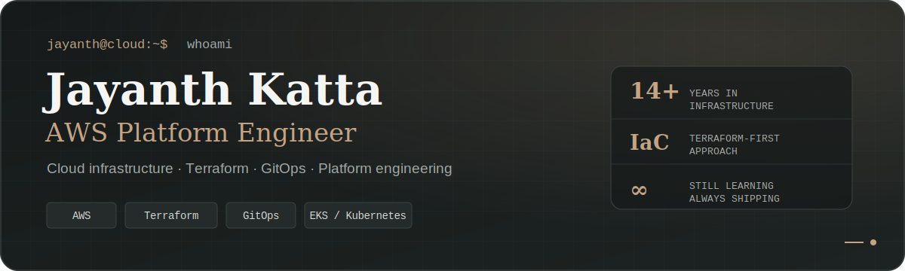

<br />


<br />

<p>
  <a href="https://jayanthkatta.com"></a>&nbsp;·&nbsp;
  <a href="https://jayanthkatta.com/blog/"></a>&nbsp;·&nbsp;
  <a href="https://jayanthkatta.com/now.html"></a>&nbsp;·&nbsp;
  <a href="https://jayanthkatta.com/resume.html"></a>&nbsp;·&nbsp;
  <a href="https://www.linkedin.com/in/jayanthkatta"></a>
</p>

</div>

<p align="center">
  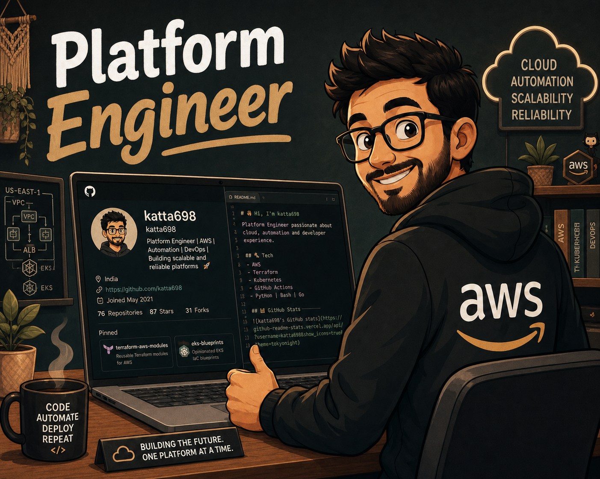
</p>

I build production-grade AWS infrastructure: VPCs that do not leak, IAM that does not over-trust, and pipelines that do not fail at 2 a.m. I am currently focused on multi-account AWS architecture, platform automation, and documenting the decisions that make systems understandable.

> Every manual step is a future incident. Every undocumented decision is a future mystery. I build to eliminate both.

---

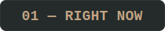

| Focus | Current work |
|:---|:---|
| **Building** | Week 8 complete — S3 Intelligent Storage Platform in my 52-week AWS Platform Engineering Lab |
| **Learning** | HashiCorp Certified Terraform Associate 004 |
| **Pursuing** | AWS Solutions Architect Professional |

---

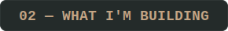

| Area | Engineering focus |
|:---|:---|
| **Multi-account AWS** | Organizations, SCPs, Transit Gateway, and centralized logging |
| **Terraform at scale** | Remote state, reusable modules, workspaces, and drift detection |
| **GitOps pipelines** | GitHub Actions plan/apply workflows with approval gates |
| **Container platforms** | EKS provisioning, node groups, and Helm-based workloads |
| **Database modernization** | RDS migrations, HA patterns, snapshots, and cross-region replication |

---

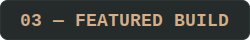

#### 30 Days AWS + Terraform Challenge

A structured, hands-on series building real AWS infrastructure from the ground up—not toy examples.

`VPC design` → `IAM provisioning` → `S3 remote state` → `EC2 + ALB` → `RDS HA` → `CloudWatch` → `EKS` → `GitHub Actions`

Each day includes working Terraform, architectural decisions, and an honest account of what broke and why.

<a href="https://github.com/katta698/30-days-aws-terraform"></a>

---

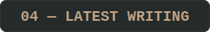

<!-- BLOG-POST-LIST:START -->
- EBS Savings Dashboard — Phase 1 — Jul 2026 <a href="https://jayanthkatta.com/blog/ebs-savings-dashboard-phase1/">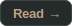</a>
- Week 8 - S3 Intelligent Storage Platform: Tiering, Lifecycle, and Cost Automation — Jun 2026 <a href="https://jayanthkatta.com/blog/week-8-s3-intelligent-storage-platform/"></a>
- Week 7 - IAM Identity Center SSO: Multi-Account Permission Sets — Jun 2026 <a href="https://jayanthkatta.com/blog/week-7-iam-identity-center-sso-multi-account-permission-sets/"></a>
- Week 6 - Building an Account Vending Machine with AWS Organizations, SCPs &amp; Step Functions &lpar;No Control Tower&rpar; — Jun 2026 <a href="https://jayanthkatta.com/blog/week-6-account-vending-machine-with-aws-organizations-and-scps/"></a>
- Week 5 - Cost Anomaly Detection with AWS Cost Explorer, SNS, and Lambda — Jun 2026 <a href="https://jayanthkatta.com/blog/week-5-cost-anomaly-detection-with-aws-cost-explorer-sns-and/"></a>

<!-- BLOG-POST-LIST:END -->

<a href="https://jayanthkatta.com/blog/">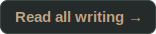</a>

---

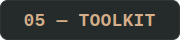

<p align="center">
  
  
  
  
  
  
  
  
  
</p>

---

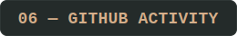

<p align="center">
  
  
</p>

<p align="center">
  
</p>

<p align="center">
  <picture>
    <source media="(prefers-color-scheme: dark)" srcset="https://raw.githubusercontent.com/katta698/katta698/output/github-contribution-grid-snake-dark.svg" />
    <source media="(prefers-color-scheme: light)" srcset="https://raw.githubusercontent.com/katta698/katta698/output/github-contribution-grid-snake.svg" />
    
  </picture>
</p>

---

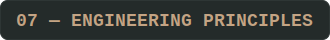

```text
Provision  →  Harden  →  Automate  →  Monitor  →  Document  →  Iterate
```

> *If it is not in code, it does not exist.*<br />
> *If it is not monitored, it is not running.*<br />
> *If it is not documented, only one person knows it.*

---

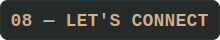

<p>
  <a href="https://www.linkedin.com/in/jayanthkatta"></a>
  <a href="https://jayanthkatta.com/blog/"></a>
  <a href="https://github.com/katta698"></a>
  
</p>

<div align="center">

`building resilient systems · documenting the journey · always learning`

</div>

