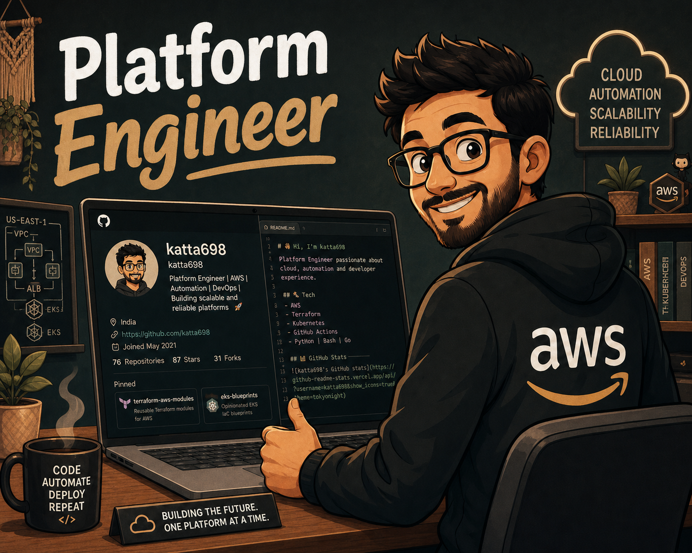

<div align="center">

<br />
<p>
  <a href="https://jayanthkatta.com"></a>&nbsp;·&nbsp;
  <a href="https://jayanthkatta.com/blog/"></a>&nbsp;·&nbsp;
  <a href="https://jayanthkatta.com/now.html"></a>&nbsp;·&nbsp;
  <a href="https://jayanthkatta.com/resume.html"></a>&nbsp;·&nbsp;
  <a href="https://www.linkedin.com/in/jayanthkatta"></a>
</p>
<p align="center">
  
</p>
</div>

I build production-grade AWS infrastructure: VPCs that do not leak, IAM that does not over-trust, and pipelines that do not fail at 2 a.m. I am currently focused on multi-account AWS architecture, platform automation, and documenting the decisions that make systems understandable.

> Every manual step is a future incident. Every undocumented decision is a future mystery. I build to eliminate both.

---


| Focus | Current work |
|:---|:---|
| **Building** | Week 12 - AWS Config Compliance Automation: The Drift Security Hub Never Sees - 52-week AWS Platform Engineering Lab |
| **Learning** | HashiCorp Certified Terraform Associate 004 |
| **Pursuing** | AWS Solutions Architect Professional |

---


| Area | Engineering focus |
|:---|:---|
| **Multi-account AWS** | Organizations, SCPs, Transit Gateway, and centralized logging |
| **Terraform at scale** | Remote state, reusable modules, workspaces, and drift detection |
| **GitOps pipelines** | GitHub Actions plan/apply workflows with approval gates |
| **Container platforms** | EKS provisioning, node groups, and Helm-based workloads |
| **Database modernization** | RDS migrations, HA patterns, snapshots, and cross-region replication |

---


Three ongoing series. Counts below are generated from the blog, not typed by hand.

<!-- SERIES-LIST:START -->
| Series | What it is | Published |
|:---|:---|:---|
| **AWS Architecture Series** | One enterprise pattern at a time — the decision, the trade-offs, and what it costs when it is made badly. | 15 posts |
| **AWS Weekly Lab** | One production-grade capability built end to end each week. Working Terraform, an architecture diagram, and an honest writeup of what broke. | 12 of 52 |
| **AWS Daily Intelligence** | What AWS shipped, and whether it actually changes anything. Every claim cited to official AWS documentation. | 5 posts |
<!-- SERIES-LIST:END -->

<a href="https://github.com/katta698/AWS-Platform-Engineering-Lab"></a>

---


<!-- BLOG-POST-LIST:START -->
- AWS Daily Intelligence #6 - IPAM Adds BGP Route Protection and Delegated RPKI — Aug 8, 2026 <a href="https://jayanthkatta.com/blog/aws-daily-intelligence-ipam-bgp-route-protection/"></a>
- AWS Architecture Series #15 — VPC Endpoints vs NAT Gateway: Paying Egress on Traffic That Never Left AWS — Aug 8, 2026 <a href="https://jayanthkatta.com/blog/aws-architecture-vpc-endpoints-nat-gateway/"></a>
- AWS Daily Intelligence #5 - ECS Fractional GPU Scheduling on G6f Instances — Aug 7, 2026 <a href="https://jayanthkatta.com/blog/aws-daily-intelligence-ecs-fractional-gpu-scheduling/"></a>
- AWS Architecture Series #14 — S3 Storage Classes: Why “Just Move It to Glacier” Made the Bill Go Up — Aug 7, 2026 <a href="https://jayanthkatta.com/blog/aws-architecture-s3-storage-classes-lifecycle/"></a>
- AWS Daily Intelligence #4 - DynamoDB Adds Real-Time Vector Search — Aug 6, 2026 <a href="https://jayanthkatta.com/blog/aws-daily-intelligence-dynamodb-vector-search/"></a>
<!-- BLOG-POST-LIST:END -->

<a href="https://jayanthkatta.com/blog/"></a>

---


<p align="center">
  
  
  
  
  
  
  
  
  
</p>
----


<p align="center">
  
  
</p>
<p align="center">
  
</p>
<p align="center">
  <picture>
    <source media="(prefers-color-scheme: dark)" srcset="https://raw.githubusercontent.com/katta698/katta698/output/github-contribution-grid-snake-dark.svg" />
    <source media="(prefers-color-scheme: light)" srcset="https://raw.githubusercontent.com/katta698/katta698/output/github-contribution-grid-snake.svg" />
    
  </picture>
</p>
---


```text
Provision  →  Harden  →  Automate  →  Monitor  →  Document  →  Iterate
```
> *If it is not in code, it does not exist.*<br />
> *If it is not monitored, it is not running.*<br />
> *If it is not documented, only one person knows it.*
---


<p>
  <a href="https://www.linkedin.com/in/jayanthkatta"></a>
  <a href="https://jayanthkatta.com/blog/"></a>
  <a href="https://github.com/katta698"></a>
  
</p>
<div align="center">
`building resilient systems · documenting the journey · always learning`
</div>
